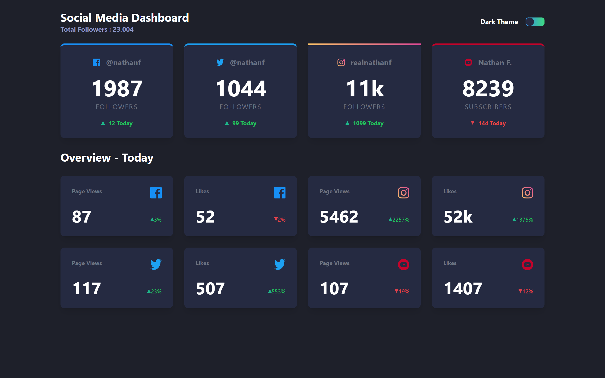

# Frontend Mentor - Social media dashboard with theme switcher solution

This is a solution to the [Social media dashboard with theme switcher challenge on Frontend Mentor](https://www.frontendmentor.io/challenges/social-media-dashboard-with-theme-switcher-6oY8ozp_H). Frontend Mentor challenges help you improve your coding skills by building realistic projects.

## Table of contents

- [Overview](#overview)
  - [The challenge](#the-challenge)
  - [Screenshot](#screenshot)
  - [Links](#links)
- [My process](#my-process)
  - [Built with](#built-with)
  - [What I learned](#what-i-learned)
- [Author](#author)

## Overview

### The challenge

Users should be able to:

- View the optimal layout for the site depending on their device's screen size
- See hover states for all interactive elements on the page
- Toggle color theme to their preference

### Screenshot



### Links

- Solution URL: [Add solution URL here](https://github.com/Ozioma45/social-media-dashboard-with-theme-switcher)
- Live Site URL: [Add live site URL here](https://social-media-dashboard-with-theme-switcher-sable-omega.vercel.app/)

## My process

### Built with

- Semantic HTML5 markup
- CSS custom properties
- Flexbox
- CSS Grid
- Mobile-first workflow
- [React](https://reactjs.org/) - JS library
- [Tailwind Css](https://tailwindcss.com/) - Css framework
- [Styled Components](https://styled-components.com/) - For styles

### What I learned

i really enjoyed practicin the theme switcher with this project and i look forward to building more project with it

a snippet of the code, see below:

```js
const [theme, setTheme] = useState(null);

useEffect(() => {
  if (window.matchMedia("(prefers-color-scheme: dark)").matches) {
    setTheme("dark");
  } else {
    setTheme("light");
  }
}, []);

useEffect(() => {
  if (theme === "dark") {
    document.documentElement.classList.add("dark");
  } else {
    document.documentElement.classList.remove("dark");
  }
}, [theme]);

const handleThemeSwitch = () => {
  setTheme(theme === "dark" ? "light" : "dark");
};
```

## Author

- Website - [Ozioma Egole](https://ozioma45.github.io/Myportfolio/)
- Frontend Mentor - [@Ozioma45](https://www.frontendmentor.io/profile/Ozioma45)
- Github - [@Ozioma45](https://github.com/Ozioma45)
